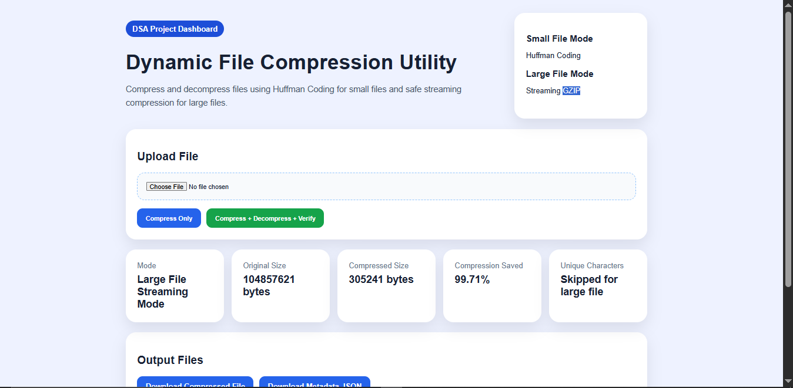
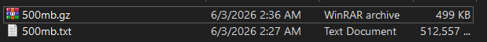
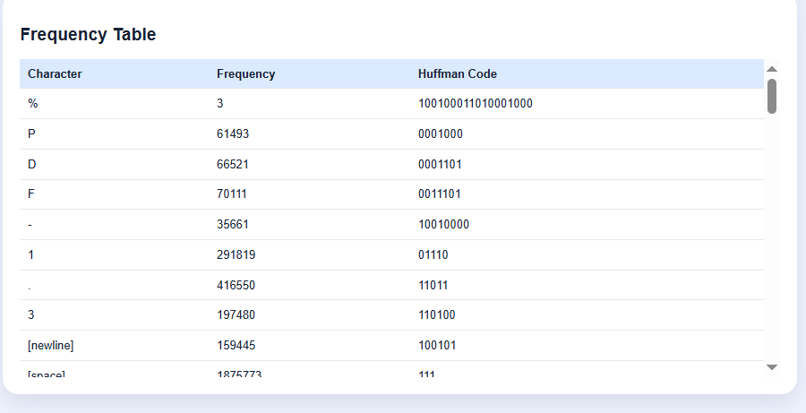
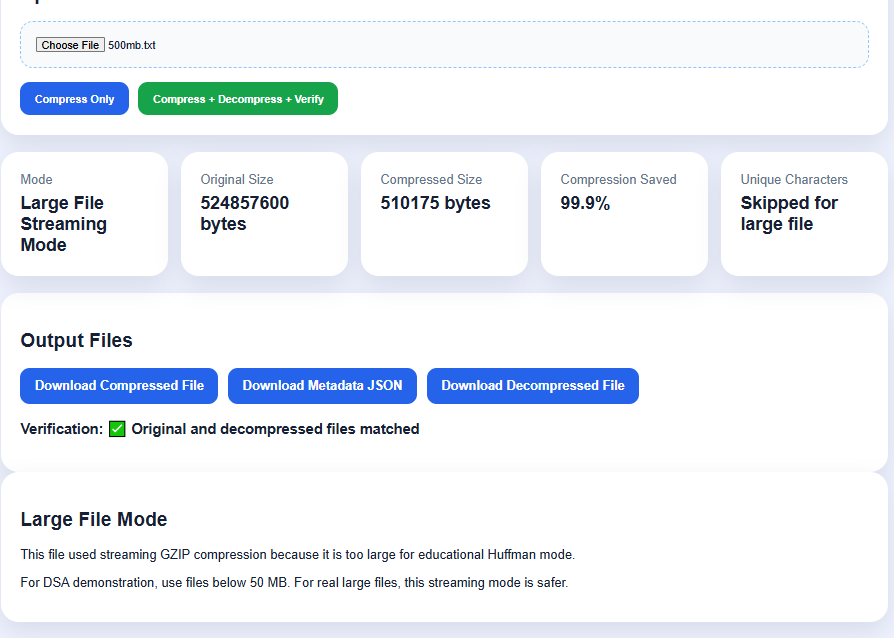
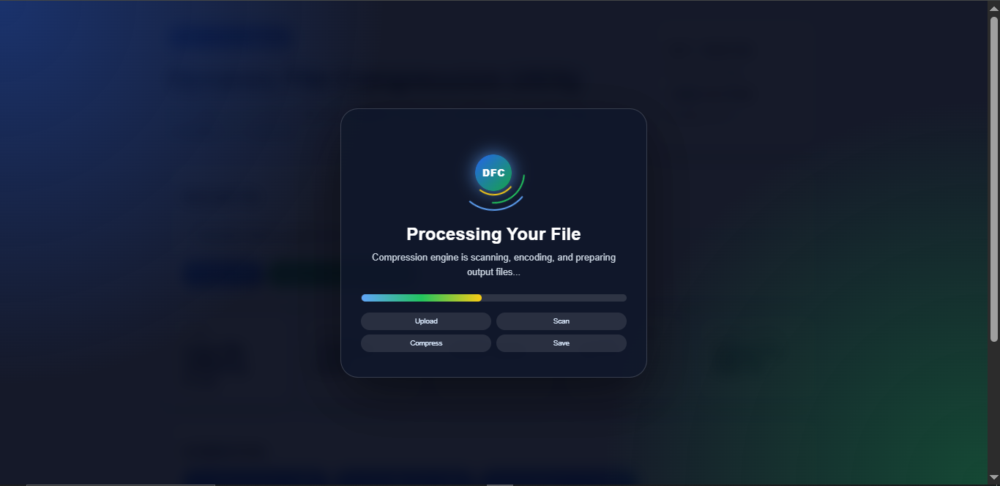

# Dynamic File Compression Utility

A DSA-based file compression and decompression project using **Huffman Coding** with a modern **Flask dashboard**.

## Author

**Atharv Bunde**

## Project Overview

Dynamic File Compression Utility compresses text files using Huffman Coding and decompresses them back to the original file. It shows how real compression tools reduce file size using Data Structures and Algorithms.

## Problem Statement

Large text files consume storage and take more time to transfer. This project reduces file size by assigning shorter binary codes to frequently occurring characters and longer binary codes to less frequent characters.

## DSA Concepts Used

- HashMap / Dictionary for character frequency
- Min Heap / Priority Queue for building Huffman Tree
- Binary Tree for Huffman code generation
- Greedy Algorithm
- File Handling
- Encoding and Decoding
- Compression Ratio Calculation

## Algorithm Workflow

```text
Input File
   ↓
Read Text Data
   ↓
Calculate Character Frequency
   ↓
Build Min Heap
   ↓
Build Huffman Tree
   ↓
Generate Huffman Codes
   ↓
Compress File
   ↓
Generate Metadata JSON
   ↓
Decompress File
   ↓
Verify Original File Recovery
```

## Folder Structure

```text
Dynamic-File-Compression-Utility-Dashboard/
│
├── input_files/
├── compressed_files/
├── decompressed_files/
├── outputs/
├── images/
├── docs/
├── src/
│   └── huffman.py
├── templates/
│   └── index.html
├── static/
│   └── css/
│       └── style.css
├── app.py
├── main.py
├── requirements.txt
├── .gitignore
└── README.md
```

## How to Run Dashboard

### 1. Open project folder

```bash
cd Dynamic-File-Compression-Utility-Dashboard
```

### 2. Create virtual environment

```bash
py -m venv venv
```

### 3. Activate virtual environment

For Windows:

```bash
venv\Scripts\activate
```

For Mac/Linux:

```bash
source venv/bin/activate
```

### 4. Install requirements

```bash
pip install -r requirements.txt
```

### 5. Run dashboard

```bash
python app.py
```

If `python` does not work on Windows, use:

```bash
py app.py
```

### 6. Open in browser

```text
http://127.0.0.1:5000
```

## How to Run CLI

### Compress sample file

```bash
python main.py compress input_files/sample.txt
```

### Decompress file

```bash
python main.py decompress compressed_files/sample.huff outputs/sample_metadata.json --out decompressed_files/sample_decompressed.txt
```

### Verify output

```bash
python main.py verify input_files/sample.txt decompressed_files/sample_decompressed.txt
```

## Expected Output

```text
Compression completed successfully.
Compressed File: compressed_files/sample.huff
Metadata File: outputs/sample_metadata.json
Original Size: 456 bytes
Compressed Size: 278 bytes
Compression Ratio: 39.04%
```

## Dashboard Features

- Upload text file
- Compress file
- Decompress file
- Verify original and decompressed output
- View original size
- View compressed size
- View compression percentage
- View frequency table
- View Huffman codes
- Download compressed file
- Download metadata JSON
- Download decompressed file

## Screenshots to Add

```text
# Screenshots

## Dashboard Home


## Download Mode & Compression Results


## Frequency Table and Huffman Codes


## Large File Streaming Mode


## Stylish Loading Screen


## Original vs Compressed Files


## Project Folder Structure

```

Then use this in README:


**Description**

```text
DSA-based Dynamic File Compression Utility using Huffman Coding, Min Heap, Binary Tree, Flask Dashboard, CLI, compression ratio analysis, and file recovery verification.
```

**Topics**

```text
dsa python huffman-coding file-compression flask-dashboard greedy-algorithm min-heap binary-tree data-structures
```


## 👨‍💻 Author

**Atharv Bunde**  
Mechatronics Engineering Student

### Connect With Me

- LinkedIn: https://www.linkedin.com/in/atharv-bunde
- GitHub: https://github.com/Atharvbunde

---